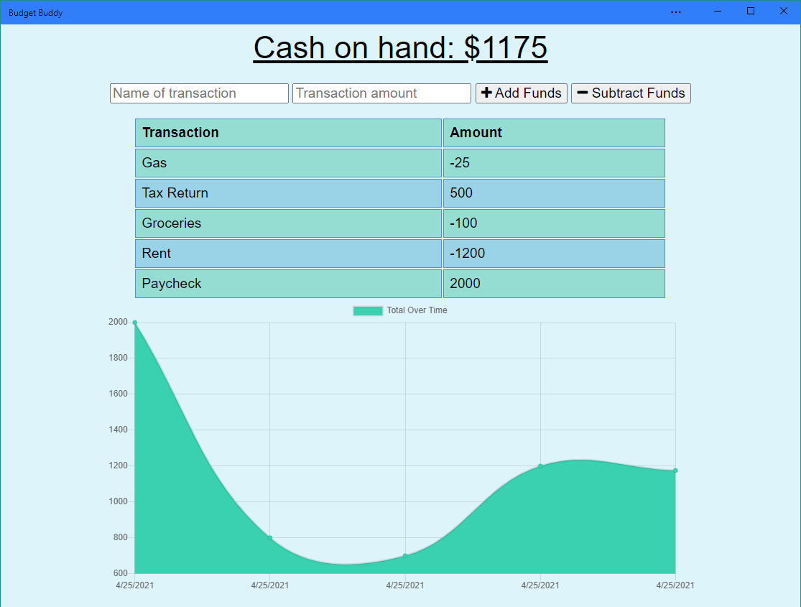

# 24/7 Budget Buddy
Track spending both on and offline to keep tabs on your cashflow.

https://intense-hollows-48841.herokuapp.com/

## Table of Contents

* [Walkthrough](#walkthrough)
* [Technologies](#technologies)
* [Future Enhancements](#future-enhancements)

## Walkthrough

This application can be used on or offline. Download the desktop app to see it as a standalone application. Toggle it to offline mode and add entries to the budget, then set it back to online mode to see it add the entries when it has connection back to the database.

1. When first opening the app, you will see a chart of incoming and outgoing expenses, along with a list of the most recent entries.

2. When toggled to offline mode, we can see new entries are added to the IndexedDB to hold until the app comes back online.

3. When back online, the indexed transactions are sent to the database and cleared from the index.

## Technologies

This application uses:
* MongoDB and Mongoose
* MongoDB Atlas
* Node.js
* Express
* Fontawesome
* JavaScript
* HTML
* CSS

## Future Enhancements

There is something left to be desired with UI in this one, so that'd be the first to tackle. Otherwise, updating it so users could choose from a list of recurring expenses and adding categories to their expenses would be next on the list!